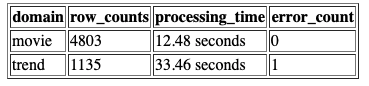
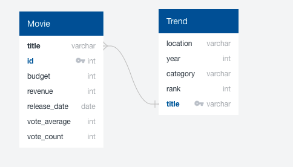

# ETL-Project

# ETL Project

### Contributor: 
Caroline Yan  
Dillon Davis  
Elizabeth Lau  

### Project Description:
In this project, we Extracted data from two CSV files, Transformed them after cleaning, created a connection to pgAdmin, and Loaded them by querying the database. 

### Extraction: We extracted two databases from the public platform, Kaggle. 
* Movie Database: The movie dataset is a dataset of 5000 movies from TMDB (The Movie Database).
* Google Trend Database: The Google Trends dataset contains the top five most trending terms for many categories in every year since 2001. The dataset includes many countries, and a section of the dataset is for global trends, which was the main focus of this project.
 * Limitations: The main limitation of the data is that a term may be trending for reasons other than a movie. For example, the dataset of movies contains a 2015 movie called “Wimbledon,” but the term was trending because of the annual tennis tournament.
.				
### Transformation: 
* Filtered the movie data by id, title, budget, revenue, release_date, vote_average, vote_count
* Filtered the google trend data by location, year, category, rank, and title.
* Renamed column names
* Set index
* Dropped duplicates

### Load: 
* Created a connection to pgAdmin
* Created an HTML file to show the final technical report

### Data Source:
* Movie Database: https://www.kaggle.com/tmdb/tmdb-movie-metadata
* Google Trend Database: https://www.kaggle.com/dhruvildave/google-trends-dataset

### Final Technical Report

### ERD Diagram

